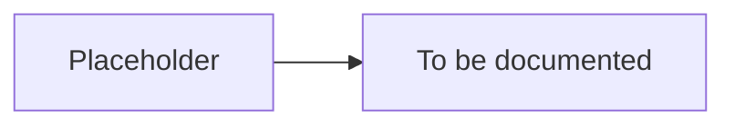

# Introduction

> Placeholder page — content to be expanded.

---

## Overview

<!-- What TapMind is and who this documentation is for -->

---

## Why It Exists

<!-- The problem TapMind solves and the platform's mission -->

---

## How It Works

<!-- High-level summary of how the platform operates -->

---

## Business Benefit

<!-- Value delivered to clients, end users, and the business -->

---

## Failure Scenarios

<!-- Platform-level risks and how they are mitigated or communicated -->

---

## Related Components

<!-- Links to architecture, SDK, backend, reporting, and glossary pages -->

- [02-System-Architecture.md](./02-System-Architecture.md)
- [06-Glossary.md](./06-Glossary.md)
