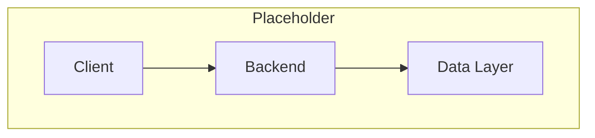

# System Architecture

> Placeholder page — content to be expanded.

---

## Overview

<!-- High-level view of TapMind's major systems and how they connect -->

---

## Why It Exists

<!-- Why a documented architecture matters for TapMind stakeholders -->

---

## How It Works

<!-- Component diagram, layers, and communication patterns -->

---

## Business Benefit

<!-- How clear architecture supports reliability, scaling, and client trust -->

---

## Failure Scenarios

<!-- Single points of failure, degradation modes, and recovery approach -->

---

## Related Components

<!-- Links to SDK, backend, reporting, and infrastructure topics -->

- [03-SDK-Flow.md](./03-SDK-Flow.md)
- [04-Backend-Serving-Flow.md](./04-Backend-Serving-Flow.md)
- [05-Reporting-Pipeline.md](./05-Reporting-Pipeline.md)
