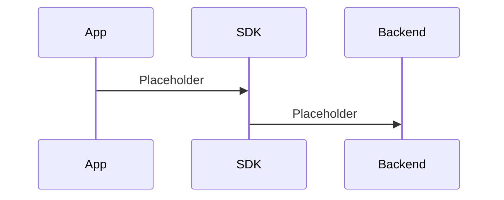

# SDK Flow

> Placeholder page — content to be expanded.

---

## Overview

<!-- What the TapMind SDK does and where it runs -->

---

## Why It Exists

<!-- Why client-side capture and integration via SDK is required -->

---

## How It Works

<!-- End-to-end SDK initialization, events, and transmission -->

---

## Business Benefit

<!-- Faster integration, consistent data capture, and client enablement -->

---

## Failure Scenarios

<!-- SDK init failures, network errors, invalid config, and fallback behavior -->

---

## Related Components

<!-- Links to backend serving, architecture, and glossary -->

- [02-System-Architecture.md](./02-System-Architecture.md)
- [04-Backend-Serving-Flow.md](./04-Backend-Serving-Flow.md)
- [06-Glossary.md](./06-Glossary.md)
