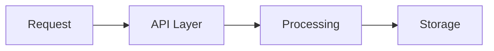

# Backend Serving Flow

> Placeholder page — content to be expanded.

---

## Overview

<!-- How TapMind's backend receives, processes, and serves requests -->

---

## Why It Exists

<!-- Role of the backend in the platform and why this flow is documented -->

---

## How It Works

<!-- Request lifecycle, queues, caches, and persistence -->

---

## Business Benefit

<!-- Reliability, performance, and scalable serving for clients -->

---

## Failure Scenarios

<!-- Timeouts, overload, dependency outages, and error handling -->

---

## Related Components

<!-- Links to SDK, reporting, architecture, and infrastructure -->

- [03-SDK-Flow.md](./03-SDK-Flow.md)
- [05-Reporting-Pipeline.md](./05-Reporting-Pipeline.md)
- [02-System-Architecture.md](./02-System-Architecture.md)
