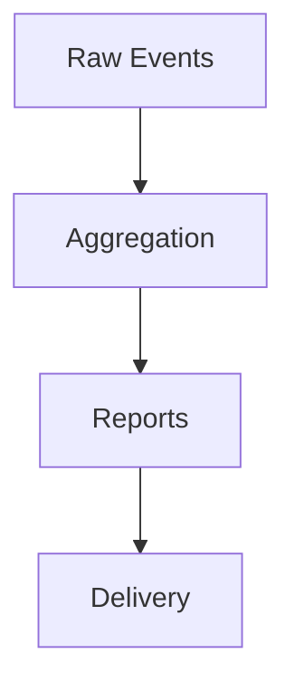

# Reporting Pipeline

> Placeholder page — content to be expanded.

---

## Overview

<!-- How data becomes reports, dashboards, and actionable insights -->

---

## Why It Exists

<!-- Why reporting is a core TapMind capability and what decisions it supports -->

---

## How It Works

<!-- Ingestion, aggregation, scheduling, and delivery of reports -->

---

## Business Benefit

<!-- Visibility, ROI measurement, and client-facing value -->

---

## Failure Scenarios

<!-- Data delays, partial aggregates, export failures, and reconciliation -->

---

## Related Components

<!-- Links to backend flow, architecture, and glossary -->

- [04-Backend-Serving-Flow.md](./04-Backend-Serving-Flow.md)
- [02-System-Architecture.md](./02-System-Architecture.md)
- [06-Glossary.md](./06-Glossary.md)
