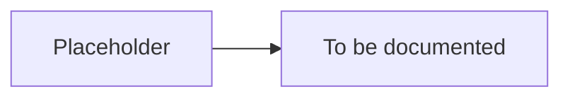

# [Page Title]

> Placeholder page. Copy this template when adding new content pages. See [DOCUMENTATION_RULES.md](./DOCUMENTATION_RULES.md) for full writing standards.

---

## Real-World Example

<!-- Start with a relatable scenario. Example: "When you open Cricbuzz and see an advertisement..." -->

---

## Why This Matters

<!-- What problem exists? Why should the reader care? -->

---

## Concept Explanation

<!-- Explain relevant AdTech concepts in plain English. Introduce terms only when they become relevant. -->

---

## TapMind Implementation

<!-- How TapMind addresses this problem at a high level. Where does TapMind fit? -->

---

## Technical Details

<!-- Implementation specifics. Only after business context is established. -->

---

## Related Pages

<!-- Links to related documentation -->

- [Related Page](./related-page.md)
