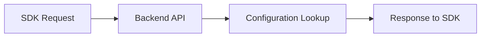

# Backend Serving Flow

> Placeholder page — content to be expanded.

---

## Overview

<!-- How the TapMind backend receives requests and returns configuration -->

---

## Why It Exists

<!-- Central role of the backend in ad serving and configuration delivery -->

---

## Business Problem

<!-- Publishers need dynamic, correct configuration without app updates -->

---

## High Level Explanation

<!-- Plain-language request lifecycle: auth, lookup, assembly, response -->

---

## Technical Details

<!-- API endpoints, caching, config assembly — after business context -->

---

## Business Benefit

<!-- Real-time control, reduced release cycles, and operational flexibility -->

---

## Related Pages

- [End-to-End Ad Journey](./end-to-end-ad-journey.md)
- [SDK Flow](./sdk-flow.md)
- [Demand Partner Selection](./demand-partner-selection.md)
- [Dashboard Hierarchy](../configuration-management/dashboard-hierarchy.md)
