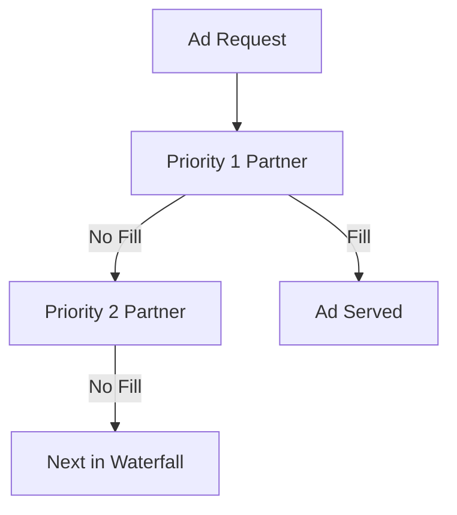

# Demand Partner Selection

> Placeholder page — content to be expanded.

---

## Overview

<!-- How TapMind selects demand partners using priorities and waterfalls -->

---

## Why It Exists

<!-- Why mediation and partner ordering are core to revenue optimization -->

---

## Business Problem

<!-- Maximizing fill rate and eCPM across multiple demand sources -->

---

## High Level Explanation

<!-- Plain-language explanation of priority, waterfall, and selection logic -->

---

## Technical Details

<!-- Priority rules, timeout handling, TTL — after business context -->

---

## Business Benefit

<!-- Higher revenue, better fill rates, and configurable partner strategy -->

---

## Related Pages

- [End-to-End Ad Journey](./end-to-end-ad-journey.md)
- [Demand Partner Configuration](../configuration-management/demand-partner-configuration.md)
- [Placement Configuration](../configuration-management/placement-configuration.md)
