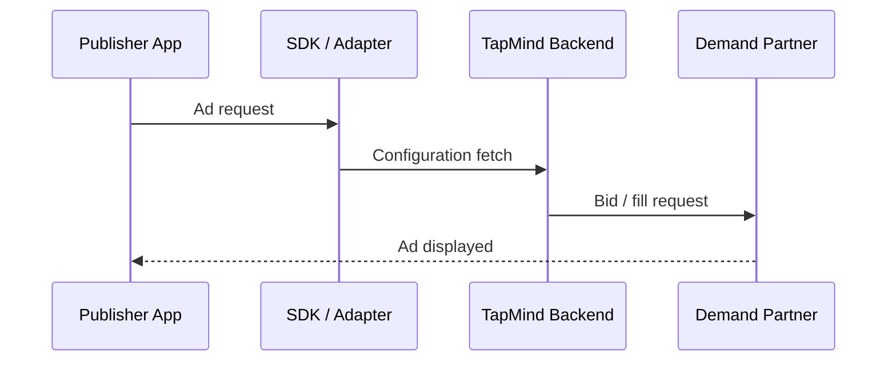

# End-to-End Ad Journey

> Placeholder page — content to be expanded.

---

## Overview

<!-- Single high-level flow from ad request to ad display -->

---

## Why It Exists

<!-- Why a unified journey view matters for PMs and client stakeholders -->

---

## Business Problem

<!-- Opacity in the ad lifecycle creates trust and revenue questions -->

---

## High Level Explanation

<!-- Plain-language walkthrough: request → mediation → selection → display → reporting -->

---

## Technical Details

<!-- Step-by-step implementation — after business context -->

---

## Business Benefit

<!-- Transparency, revenue optimization, and client confidence -->

---

## Related Pages

- [SDK Flow](./sdk-flow.md)
- [Backend Serving Flow](./backend-serving-flow.md)
- [Demand Partner Selection](./demand-partner-selection.md)
- [Event Lifecycle](../reporting-analytics/event-lifecycle.md)
