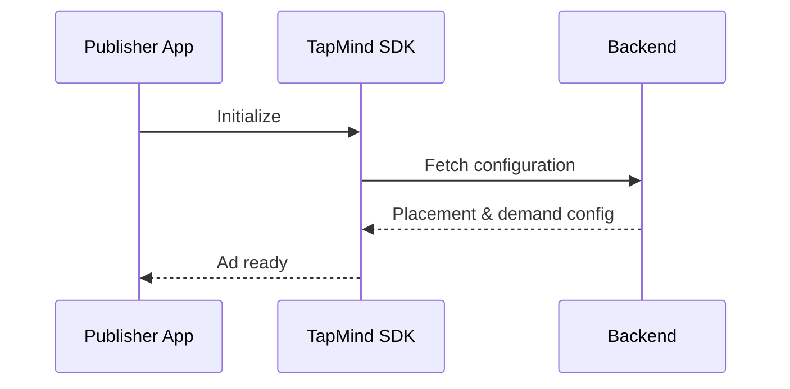

# SDK Flow

> Placeholder page — content to be expanded.

---

## Overview

<!-- How the TapMind SDK participates in the ad serving process -->

---

## Why It Exists

<!-- Why SDK integration is a core part of the platform -->

---

## Business Problem

<!-- Publishers need a reliable, low-friction way to request and display ads -->

---

## High Level Explanation

<!-- Plain-language SDK lifecycle: init, request, receive config, render, report -->

---

## Technical Details

<!-- SDK initialization, API calls, event hooks — after business context -->

---

## Business Benefit

<!-- Faster integration, consistent behavior, and standardized reporting -->

---

## Related Pages

- [End-to-End Ad Journey](./end-to-end-ad-journey.md)
- [Custom Adapter vs OrchSDK](../getting-started/custom-adapter-vs-orchsdk.md)
- [Backend Serving Flow](./backend-serving-flow.md)
