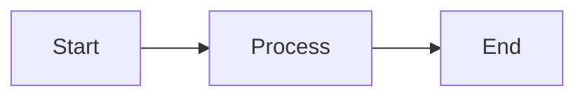
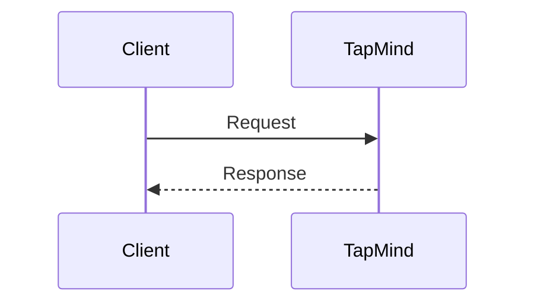

# Mermaid Diagrams

> Placeholder page — content to be expanded.

---

## Overview

<!-- Shared Mermaid diagram patterns and conventions for TapMind documentation -->

---

## Why It Exists

<!-- Consistent visual language across all documentation pages -->

---

## Business Problem

<!-- Inconsistent diagrams confuse readers and reduce documentation quality -->

---

## High Level Explanation

<!-- When and how to use flowcharts, sequence diagrams, and entity diagrams -->

### Flowchart example

### Sequence diagram example

---

## Technical Details

<!-- Diagram naming, file references, and GitBook rendering notes -->

---

## Business Benefit

<!-- Clearer communication across PMs, clients, support, and developers -->

---

## Related Pages

- [High Level Architecture](../architecture/high-level-architecture.md)
- [End-to-End Ad Journey](../ad-serving/end-to-end-ad-journey.md)
- [Reporting Architecture](../reporting-analytics/reporting-architecture.md)
- [Documentation Rules](../DOCUMENTATION_RULES.md)
