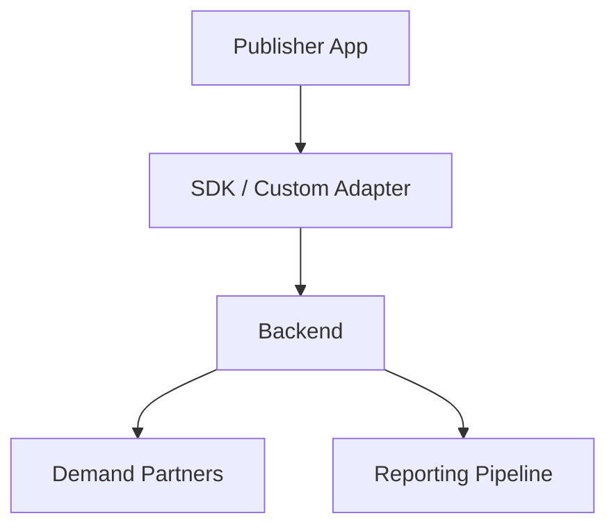

# High Level Architecture

> Placeholder page — content to be expanded.

---

## Overview

<!-- Bird's-eye view of TapMind's major systems and how they connect -->

---

## Why It Exists

<!-- Why a documented architecture matters for stakeholders -->

---

## Business Problem

<!-- Complexity of ad serving, mediation, and reporting without clear architecture -->

---

## High Level Explanation

<!-- Plain-language walkthrough of system layers and data flow -->

---

## Technical Details

<!-- Component boundaries, services, and infrastructure — after business context -->

---

## Business Benefit

<!-- How clear architecture supports reliability, scaling, and client trust -->

---

## Related Pages

- [Core Components](./core-components.md)
- [End-to-End Ad Journey](../ad-serving/end-to-end-ad-journey.md)
- [Reporting Architecture](../reporting-analytics/reporting-architecture.md)
