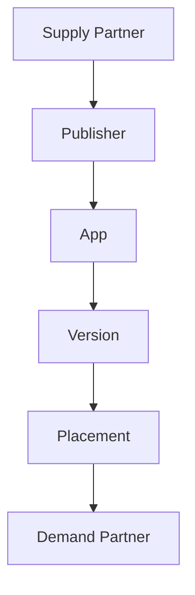

# Dashboard Hierarchy

> Placeholder page — content to be expanded.

---

## Overview

<!-- Configuration hierarchy: Supply Partner → Publisher → App → Version → Placement → Demand Partner -->

---

## Why It Exists

<!-- Why TapMind organizes configuration in a nested hierarchy -->

---

## Business Problem

<!-- Complex multi-tenant setups need clear, manageable configuration structure -->

---

## High Level Explanation

<!-- Plain-language walkthrough of each level and how they relate -->

---

## Technical Details

<!-- Dashboard entities, inheritance, and override rules — after business context -->

---

## Business Benefit

<!-- Scalable configuration, clear ownership, and reduced setup errors -->

---

## Related Pages

- [Placement Configuration](./placement-configuration.md)
- [Demand Partner Configuration](./demand-partner-configuration.md)
- [Terminology & Glossary](../architecture/terminology-glossary.md)
