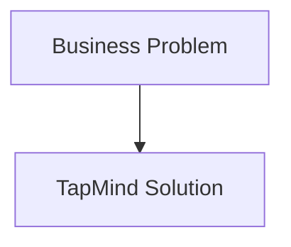

# Business Problems We Solve

> Placeholder page — content to be expanded.

---

## Overview

<!-- Summary of the business problems TapMind is designed to solve -->

---

## Why It Exists

<!-- Why documenting these problems matters for PMs and clients -->

---

## Business Problem

<!-- Specific pain points: monetization, mediation, reporting, configuration, etc. -->

---

## High Level Explanation

<!-- How TapMind approaches each problem category -->

---

## Technical Details

<!-- How solutions map to platform capabilities — after business context -->

---

## Business Benefit

<!-- Outcomes clients and stakeholders can expect -->

---

## Related Pages

- [What is TapMind](./what-is-tapmind.md)
- [Core Components](../architecture/core-components.md)
- [End-to-End Ad Journey](../ad-serving/end-to-end-ad-journey.md)
