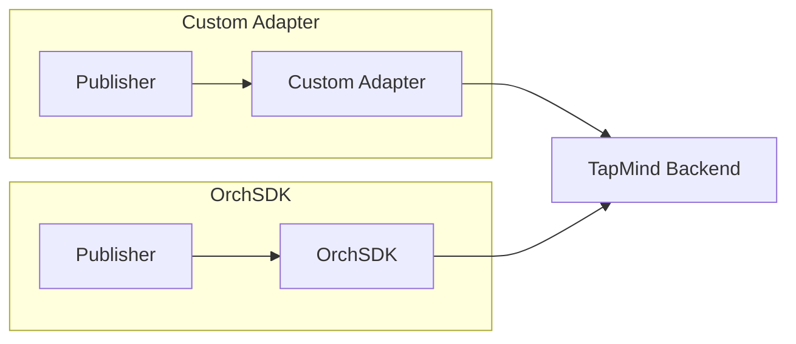

# Custom Adapter vs OrchSDK

> Placeholder page — content to be expanded.

---

## Overview

<!-- Simple comparison of Custom Adapter and OrchSDK integration paths -->

---

## Why It Exists

<!-- Why TapMind offers two integration models -->

---

## Business Problem

<!-- When publishers need custom control vs standardized SDK integration -->

---

## High Level Explanation

<!-- Plain-language explanation of the difference and when to use each -->

---

## Technical Details

<!-- Implementation differences — after business context -->

---

## Business Benefit

<!-- Trade-offs and benefits for each integration path -->

---

## Related Pages

- [What is TapMind](./what-is-tapmind.md)
- [SDK Flow](../ad-serving/sdk-flow.md)
- [Core Components](../architecture/core-components.md)
