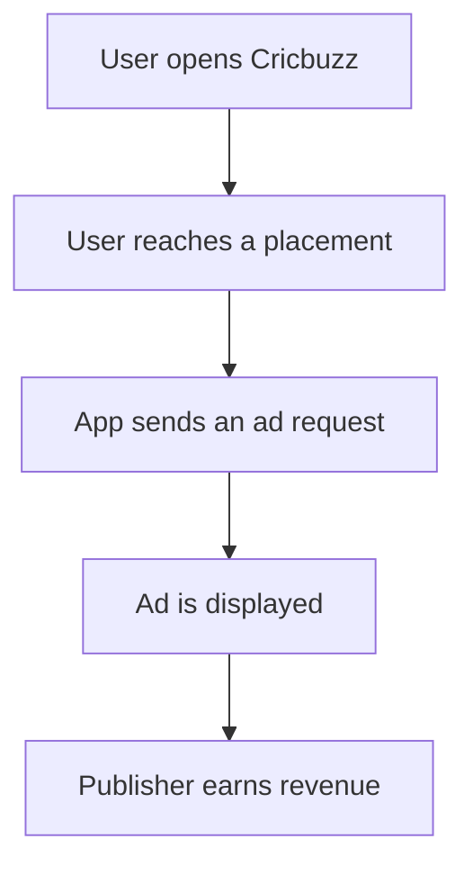

# How Mobile Ads Work

You do not need AdTech experience to understand this page. We start with something you have seen many times: an ad inside a mobile app.

---

## Real-World Example

You open **Cricbuzz** to check live cricket scores.

Between articles or at the bottom of the screen, you see an advertisement. It might be a brand logo, a product image, or a short video.

You did not search for that ad. It appeared because the app is set up to show ads in specific locations.

That single moment raises a simple question: **how did that ad get there?**

The answer involves a few core ideas: who owns the app, where the ad appears, what happens when the app needs an ad, and how money is earned. We will walk through each one using Cricbuzz as our example.

---

## Why This Matters

Mobile apps are often free to download. Many publishers (app owners) rely on advertising to earn revenue instead of charging users upfront.

If you work in product, operations, support, or engineering, you will hear terms like **publisher**, **placement**, and **ad request** regularly. Understanding them in plain language makes every later conversation easier.

This page builds the foundation. Nothing here requires technical knowledge. We are explaining what happens before any platform-specific details.

---

## Concept Explanation

### What advertisements in apps are

An in-app advertisement is a paid message shown to users while they use an app. The advertiser pays to reach that audience. The app owner earns money for providing the space.

In Cricbuzz, ads might appear as banners, full-screen images, or short videos. They are part of the app's business model.

### What a Publisher is

The **publisher** is the organization that owns and operates the app.

Cricbuzz is the publisher of the Cricbuzz app. They create the experience users enjoy. They also decide that certain parts of the app can show advertisements.

When documentation refers to a "publisher," think: **the app owner**.

### What a Placement is

A **placement** is a specific location inside the app where an ad can appear.

Not every part of an app shows ads. Publishers choose deliberate spots: below a scorecard, between news articles, or on a loading screen. Each spot is a placement.

On Cricbuzz, one placement might be a banner below the live score. Another might be a full-screen ad when you navigate between sections. Same app, different locations, different placements.

### What an Ad Request is

When a user reaches a placement, the app needs an ad to show. It sends an **ad request**: a signal that says, "An ad is needed here, now."

Think of it like placing an order. The app does not store a library of ads on the device. When the moment arrives, it requests one in real time.

User opens Cricbuzz → user scrolls to a placement → the app sends an ad request → an ad appears.

This happens in milliseconds, often without the user noticing anything beyond the ad itself.

### How revenue is generated

Revenue is earned when advertising works as intended.

Advertisers pay to show their message to app users. When an ad is successfully displayed (and sometimes when a user interacts with it), the publisher earns a share of that payment.

For Cricbuzz, more engaged users and more ad views across placements generally mean more revenue. Publishers care about:

- **Fill**: Did an ad actually appear when requested?
- **Engagement**: Did users notice or interact with the ad?
- **Volume**: How many ad requests happen across the app over time?

This is the business side of mobile advertising. The app provides audience and ad space. Advertisers pay for access. The publisher earns revenue.

---

## Simple Flow Diagram

The journey from opening an app to earning revenue follows a clear sequence:

Each step depends on the one before it. No ad request means no ad. No ad means no revenue from that moment.

---

## Key Takeaways

- **In-app ads** are paid messages shown to users inside mobile apps.
- The **publisher** is the app owner (for example, Cricbuzz).
- A **placement** is a specific location in the app where ads can appear.
- An **ad request** is sent when the app needs an ad for a placement.
- **Revenue** is generated when ads are successfully shown to users and advertisers pay for that exposure.

You now understand the basic journey: user, app, placement, request, ad, revenue.

---

## Next Step

You know *what* happens when an ad appears in an app. The natural next question is: **who provides the ad, and what other terms do teams use when talking about this process?**

Several important concepts sit between an ad request and the ad you see on screen. Understanding them will complete the picture before we discuss any specific platform.

Continue to **[Key AdTech Concepts](./key-adtech-concepts.md)** to learn what happens after the ad request and build the vocabulary used across the rest of this documentation.
