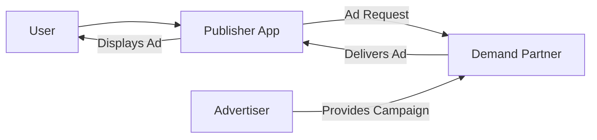

# Key AdTech Concepts

You already know what happens when an ad appears in an app: a user reaches a placement, the app sends an ad request, and an ad is displayed. This page answers the next question: **where does the advertisement actually come from?**

---

## Real-World Example

You are still in **Cricbuzz**, scrolling through match updates.

A banner appears for a sports brand. You tap past it and keep reading.

On the previous page, we explained that Cricbuzz sent an ad request when you reached that placement. But Cricbuzz did not create that sports brand ad itself. The app does not employ a team writing ads for every company in the world.

So where did it come from?

Somewhere behind the scenes, a brand paid to reach users like you. A system connected that brand's message to Cricbuzz's empty ad slot. Within milliseconds, the ad arrived and appeared on your screen.

To understand that connection, we need to meet the four participants in mobile advertising.

---

## Why This Matters

Every ad you see in an app involves multiple parties working together. Each has a distinct role and a distinct reason to exist.

If you work in product, project management, client relations, support, or development, you will hear these names in meetings, dashboards, and client conversations. Knowing who does what prevents confusion and helps you ask better questions.

This page names the participants and explains why each one is part of the ecosystem. We are still not discussing platforms, technical integration, or pricing models. Just people and roles.

---

## Concept Explanation

### The User

The **user** is the person using the app.

In our example, that is you: someone who opened Cricbuzz to check scores, read news, or follow a tournament.

**Why the user exists in this ecosystem:** Users are the audience. Advertisers want to reach them. Publishers build apps to attract and retain them. Without users, there is no one to show ads to and no reason for advertisers to pay.

Think of the user as the **guest at a venue**. Everything else in mobile advertising exists to serve content to that guest, or to show them relevant paid messages while they are there.

### The Publisher

The **publisher** is the organization that owns and operates the app.

Cricbuzz is the publisher. They built the app, maintain it, and attract millions of cricket fans.

**Why the publisher exists in this ecosystem:** Publishers create the environment where ads appear. They provide the audience (users) and the space (placements). In return, they earn revenue from advertising.

Think of the publisher as a **shopping mall owner**. They build the mall, bring in visitors, and rent display space to brands. They do not manufacture every product in the mall. They provide the location and the foot traffic.

We introduced the publisher on the previous page. Here, the important addition is: publishers need a way to fill their ad spaces with real advertisements from real brands.

### The Advertiser

The **advertiser** is the brand or company that pays to promote its product or service.

The sports brand on that Cricbuzz banner is an advertiser. They want cricket fans to see their logo, visit their website, or buy their products.

**Why the advertiser exists in this ecosystem:** Advertisers have messages to deliver and budgets to spend. They cannot personally reach every app user. They pay to access audiences that publishers have already gathered.

Think of the advertiser as a **tenant who wants a billboard**. They have something to sell and pay for visibility in a place where their target audience already spends time.

Advertisers create the actual ad content: the image, video, or message you see on screen.

### The Demand Partner

The **demand partner** is the organization that connects advertisers' ads to publishers' apps.

When Cricbuzz sends an ad request, it needs an ad to fill that slot. The demand partner maintains access to a large pool of advertisements from many advertisers. When a request arrives, the demand partner selects and delivers a suitable ad.

**Why the demand partner exists in this ecosystem:** Publishers cannot negotiate individually with thousands of advertisers. Advertisers cannot integrate separately with every app in the world. Demand partners sit in the middle and make the marketplace work at scale.

Think of a demand partner as a **wholesale supplier**. The publisher's app places an order ("I need an ad here"). The demand partner delivers one from its inventory of advertiser campaigns.

This is the direct answer to our question: **the advertisement comes from an advertiser, delivered through a demand partner, in response to the publisher's ad request.**

### How the four participants connect

Let us return to the Cricbuzz banner:

1. **You (the user)** scroll to a placement in the app.
2. **Cricbuzz (the publisher)** sends an ad request because the placement needs filling.
3. A **demand partner** receives the request and selects an ad from its available campaigns.
4. An **advertiser's** message is delivered and displayed on your screen.

Everyone plays a necessary role. Remove the user and there is no audience. Remove the publisher and there is no app or ad space. Remove the advertiser and there is no paid message. Remove the demand partner and publishers would struggle to access advertisers at scale.

---

## Simple Mermaid Diagram

The relationships between participants:

The advertiser supplies the message. The demand partner delivers it. The publisher shows it. The user sees it.

---

## Key Takeaways

- The **user** is the app audience. Advertisers want to reach users; publishers build apps to attract them.
- The **publisher** owns the app and provides ad space. Cricbuzz is a publisher.
- The **advertiser** is the brand that creates and pays for the ad message.
- The **demand partner** connects advertiser campaigns to publisher ad requests at scale.
- **Where ads come from:** An advertiser creates the message. A demand partner delivers it when the publisher's app sends an ad request.

You now know the four core participants and how they fit together.

---

## Next Step

You understand who is involved in mobile advertising and where advertisements originate. The natural next question is: **what happens when a publisher works with more than one demand partner?**

A single ad request could be filled by multiple possible sources. Publishers need a way to manage those sources, decide which one gets a chance to serve, and maximize revenue and fill rate.

Continue to **[What is Mediation?](./what-is-mediation.md)** to learn why mediation exists and how it helps publishers work with multiple ad sources.
