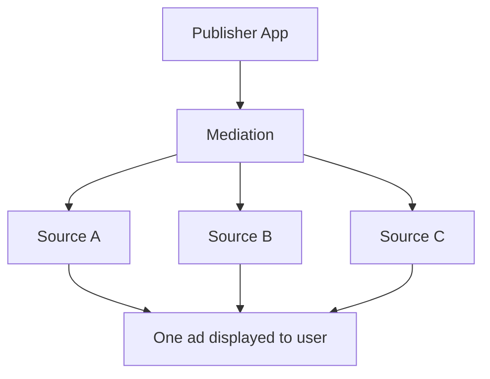

# What is Mediation?

You already understand how ads appear in apps and who participates in mobile advertising. This page answers one business question:

**Why do publishers work with multiple advertising sources, and how do they choose between them?**

The answer to that question is where mediation comes from.

---

## Real World Example

You open **Cricbuzz** and scroll to a banner placement below the live score.

Cricbuzz has an open ad slot. When you reach that placement, the app sends an ad request. Several advertising sources could each provide a different advertisement for that same slot.

But only **one** ad can appear on your screen.

So how does Cricbuzz choose?

Does it always use the same source? Does it pick at random? Does it try one source and switch to another if nothing is available?

Before we name the system that handles this, sit with the question. A popular app like Cricbuzz cannot afford empty ad slots. It also cannot afford to leave money on the table by always using the same source without comparing options.

Something must decide which advertising source gets the opportunity to fill that placement. That decision matters every time a user opens the app.

---

## Why This Matters

A publisher working with **only one** advertising source faces a ceiling.

If that source has no ad ready, the placement stays empty. If it consistently underperforms, the publisher has no alternative. If market conditions change, the publisher is locked into a single relationship.

Most serious publishers avoid that trap. They work with **multiple advertising sources** because different sources perform differently across placements, regions, and times of day.

Publishers want:

- **Higher revenue** from the best available opportunity
- **Better fill rate** so empty ad slots are rare
- **More competition** so no single source controls outcomes

That strategy creates a new business problem:

**How should the publisher choose between advertising sources when more than one could fill the same placement?**

Every product manager, operations lead, support agent, and developer touching ad monetization eventually encounters this question. The answer is not technical at first. It is about business incentives and coordination.

---

## Follow The Money

To understand why this problem exists, follow the money.

Here is the simplified flow:

1. An **advertiser** pays to show an ad to app users.
2. A **demand partner** connects that advertiser's campaign to publisher apps and earns a share of the spend.
3. **Mediation** sits in the coordination layer, managing which demand partner gets an opportunity when a placement opens.
4. The **publisher** earns revenue when an ad is successfully shown.

Why does this matter for choosing between sources?

Because **each advertising source represents a different path for advertiser money to reach the publisher**. One source might connect Cricbuzz to sports brands paying premium rates. Another might fill slots reliably but at lower rates. A third might excel in certain regions.

If multiple sources can provide an advertisement, publishers generally want the source that creates the **best outcome**: strong revenue, reliable fill, and healthy competition.

When sources compete for the same ad opportunity, publishers benefit. No single source can take the relationship for granted. The publisher gains leverage, backup options, and better overall performance.

That business reality drives everything that follows. Publishers do not add multiple sources for complexity's sake. They add them because **money follows the best available path**, and they need a fair way to decide which path to try first.

---

## What Is Mediation?

Only now does the term make sense.

**Mediation** helps publishers work with multiple advertising sources and maximize revenue by deciding which source gets an opportunity to provide an advertisement.

Mediation exists because publishers want multiple sources **competing for the same ad opportunity**. Without a coordination layer, the publisher's team would manually manage rules for every placement, every partner, and every fallback scenario.

Mediation handles that coordination. When an ad request is sent, mediation applies the publisher's business rules to decide which source gets the first chance. If that source cannot deliver, mediation moves to the next option.

Mediation is not an ad. It is not a demand partner. It is the **business layer that manages choice** between sources so publishers can earn more and fill more placements.

TapMind can participate as **one advertising source** within this setup. It is not mediation itself. We will explore TapMind's role on the next page.

---

## Simple Analogy

Think of a **travel website comparing airlines** for the same route.

You enter your destination and travel dates. Multiple airlines can fly you there. The website does not pick randomly. It compares options based on price, availability, and timing. It shows you the best path forward, with alternatives if your first choice is unavailable.

The travel website is not an airline. It coordinates airlines on your behalf so you get the best outcome.

Mediation works the same way for publishers. The ad request is the trip. The advertising sources are the airlines. Mediation compares and coordinates so the publisher gets the best available result for each placement.

---

## High-Level Diagram

A business view of how mediation coordinates multiple sources for one placement:

One placement. One ad request. Multiple possible sources. Mediation manages the choice. The user sees a single ad.

---

## Key Takeaways

- Publishers use **multiple advertising sources** to increase revenue, improve fill rate, and avoid dependency on one partner.
- **Competition between sources** gives publishers better outcomes and more control.
- **Mediation exists** because publishers need a coordinated way to choose which source gets an opportunity for each ad placement.
- **Follow the money:** advertiser spend flows through demand partners and mediation to the publisher. Better coordination means better business results.
- Mediation is a **business coordination layer**, not an ad and not a single advertising source.

You now understand why mediation exists before learning how any specific platform implements it.

---

## Next Step

We now understand why mediation exists.

But where does TapMind fit into this ecosystem?

In the next section, we will see how TapMind participates within a mediation setup and helps publishers manage advertising demand.

Continue to **[Where TapMind Fits In](./where-tapmind-fits-in.md)**.
