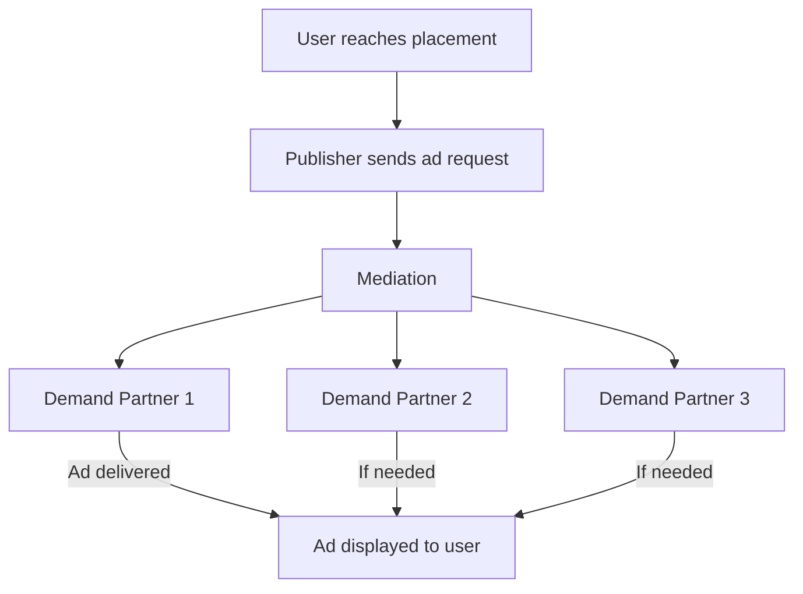

# What is Mediation?

You already know the four participants in mobile advertising and where ads come from. This page addresses the next challenge: **what happens when a publisher works with more than one advertising source?**

---

## Real-World Example

You are still using **Cricbuzz**. You scroll to a banner placement and an ad appears.

On the previous page, we explained that a demand partner delivers the ad when Cricbuzz sends an ad request. But Cricbuzz does not work with just one demand partner. Like most large publishers, it connects to **multiple advertising sources**.

One source might specialize in sports brands. Another might reach a broader consumer audience. A third might offer strong fill rates in certain regions.

When you reach that banner placement, Cricbuzz sends a single ad request. Multiple sources could potentially fill it. That raises an important question:

**If multiple demand partners can provide ads, how does the publisher decide which one gets the opportunity to serve an ad?**

This is the problem mediation solves.

---

## Why This Matters

Relying on a single advertising source is risky. If that source has no ad available at a given moment, the placement stays empty. Empty placements mean lost revenue.

Working with multiple sources improves the odds that an ad will appear. But multiple sources also create a coordination problem. Someone must decide the order of opportunity, track which source fills the slot, and make sure the process runs smoothly every time.

If you work in product, project management, client relations, support, or development, you will hear the word **mediation** often. Understanding it in plain language explains why publishers structure their ad setup the way they do.

---

## Concept Explanation

### Why publishers use multiple advertising sources

Publishers connect to multiple demand partners for practical business reasons:

- **Better fill rate:** If one source has no ad ready, another might.
- **Broader advertiser access:** Different partners reach different advertisers and industries.
- **Revenue optimization:** Publishers want the best earning opportunity for each placement, not just the first available option.
- **Reduced dependency:** Relying on one partner creates risk if that partner underperforms or has technical issues.

For Cricbuzz, using multiple sources means a cricket fan in one country might see a different campaign than a fan in another, while both see an ad instead of a blank space.

### The problem mediation solves

Without mediation, the publisher's app would need to manage every demand partner relationship directly. For each ad request, it would need rules for which source to ask first, what to do if that source has nothing, and how to try the next source.

That logic becomes complex quickly. More partners means more rules, more failure scenarios, and more manual maintenance.

**Mediation exists to handle this coordination centrally.**

### What mediation is

**Mediation** is the process (and often the platform) that manages multiple advertising sources for a publisher.

When an ad request is sent, mediation applies the publisher's rules to decide which demand partner gets the first opportunity to fill the slot. If that partner cannot fill it, mediation moves to the next source according to the configured order.

Think of mediation as a **restaurant manager coordinating suppliers**.

The kitchen needs an ingredient right now. The manager does not call every supplier at random. They follow a known order: try the primary supplier first, then the backup, then the specialty vendor. The goal is to fill the order quickly and at the best value. Mediation does the same for ad placements.

### What role mediation plays

Mediation sits between the publisher's app and its demand partners. Its role includes:

- **Managing partner relationships** so the app deals with one coordination layer instead of many separate connections
- **Applying publisher rules** about which source gets priority for each placement
- **Maximizing fill rate** by trying additional sources when the first cannot deliver an ad
- **Supporting revenue goals** by giving preferred sources the first opportunity while keeping backups available

Mediation does not create ads. It orchestrates which demand partner gets a chance to respond to each ad request.

### How mediation helps publishers

For a publisher like Cricbuzz, mediation means:

- Fewer empty ad slots when users open the app
- Less manual work managing partner order and fallback logic
- Flexibility to add, remove, or reprioritize sources without rebuilding the app
- A clearer view of which sources perform well over time

Mediation turns a messy many-to-one problem into a managed workflow the operations team can control.

### TapMind in context

TapMind can act as **one advertising source** that participates in a publisher's mediation setup. It is not mediation itself. It is a demand-side option that mediation can route ad requests to, alongside other partners.

The details of how TapMind connects to mediation are covered later. For now, remember: publishers use mediation to coordinate sources, and TapMind can be one of those sources.

---

## Mermaid Diagram

A simplified view of mediation coordinating multiple sources:

Mediation receives the request and manages which demand partner gets an opportunity to fill it. The user sees one ad. Behind the scenes, mediation coordinated the sources.

---

## Key Takeaways

- Publishers work with **multiple demand partners** to improve fill rate, reach more advertisers, and reduce dependency on a single source.
- **Mediation** coordinates those partners when an ad request is sent.
- The core problem mediation solves: deciding **which source gets the opportunity to serve an ad** when several could.
- Mediation helps publishers **maximize fill rate and revenue** while keeping partner management practical.
- **TapMind** can participate as one advertising source within a publisher's mediation setup, not as the mediation layer itself.

You now understand why mediation exists and what role it plays.

---

## Next Step

You know how ads work, who the participants are, and why mediation coordinates multiple sources. The natural next question is: **where does TapMind fit into this picture?**

TapMind is more than a single demand partner. It is a platform that helps publishers manage configuration, serving, and partner relationships. Before learning platform details, it helps to see exactly where TapMind sits relative to mediation, publishers, and demand partners.

Continue to **[Where TapMind Fits In](./where-tapmind-fits-in.md)** to understand TapMind's place in the ecosystem you have built so far.
