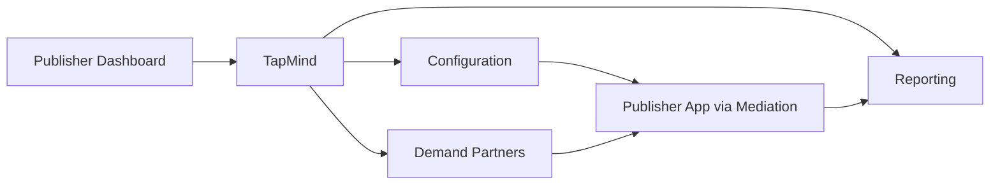

# What is TapMind

You know where TapMind sits in the ecosystem. Mediation coordinates advertising sources. TapMind participates within that setup and helps publishers manage monetization.

This page answers the next question:

**Now that I know where TapMind fits, what exactly does TapMind do and why would a publisher use it?**

---

## Real World Scenario

**Cricbuzz** monetizes through in-app advertising. The app uses mediation to coordinate multiple advertising sources. TapMind is one of those sources and provides tools to manage demand partners, configuration, and reporting.

When monetization was small, the operations team could manage a handful of partners with spreadsheets and manual updates. As Cricbuzz grew, the picture changed.

More placements across the app. More demand partners. More frequent configuration changes. More stakeholders asking for performance numbers that did not always match across tools.

Each new partner added another dashboard, another set of rules, and another reporting view. Changing partner priority for a single placement might touch multiple systems. Product wanted faster experiments. Operations wanted fewer errors. Leadership wanted one clear revenue picture.

The ecosystem worked. Mediation coordinated sources. TapMind participated. But **running monetization at scale** created operational challenges that a coordinator alone could not solve.

---

## The Problem Publishers Face

As publishers grow their ad business, four business challenges appear again and again.

### Managing multiple demand sources

Each demand partner has its own setup, rules, and expectations. Adding a partner means more relationships to maintain, not just another line in a mediation stack.

Teams lose time switching between tools and reconciling who is configured where.

### Configuration changes

Ad settings change often. Partner priorities, placement rules, and formats may need updates weekly or daily.

Without a central platform, many changes require app releases or manual workarounds. That slows response to market conditions and creates risk when settings drift out of sync.

### Reporting fragmentation

Performance data lives in different places: partner dashboards, internal spreadsheets, client reports.

When numbers do not align, trust erodes. Product, operations, and client teams spend time debating data instead of improving revenue.

### Operational overhead

Every new app version, placement, or partner multiplies coordination work. Support tickets increase. Onboarding new team members takes longer.

The business problem is not "ads are hard." The business problem is **monetization does not scale cleanly without a central place to manage it**.

---

## Why TapMind Exists

TapMind exists to solve those operational and revenue challenges.

Think of TapMind as a **control center for ad monetization**. Publishers configure how ads work in one place. TapMind supports demand partner management, configuration delivery, ad serving, and reporting so teams are not juggling disconnected systems.

**In one sentence:** TapMind helps publishers earn more from ads while keeping configuration, partner management, and reporting in one place.

TapMind is not a replacement for mediation. It works **with** mediation. Mediation decides which source gets an opportunity. TapMind helps publishers manage what happens on the TapMind side: partners, placements, serving behavior, and performance data.

Publishers use TapMind because they need:

- A single place to manage ad setup across apps and placements
- Flexibility to change ad behavior without waiting for app store releases
- Clear reporting on ad performance and revenue
- Less manual coordination as the number of partners and placements grows

---

## What TapMind Does

At a high level, TapMind connects publisher monetization goals to day-to-day operations. No implementation detail is required to understand these four areas.

### Centralized configuration

Teams define how ads behave across apps, versions, and placements from a central dashboard. When settings change, the app can pick up new configuration without a full release cycle.

### Demand partner management

Publishers add, prioritize, and manage demand partners in one workflow instead of scattered tools. This reduces errors and speeds up partner changes.

### Ad serving support

When mediation routes an ad request to TapMind, TapMind delivers the configuration and logic the publisher needs for that placement. The right settings reach the app at the right time.

### Reporting and analytics

TapMind collects performance data and feeds reporting so stakeholders share one view of impressions, fill rates, and revenue.

The cycle repeats for every placement and session: configure, serve, measure, improve.

---

## Core Platform Capabilities

TapMind supports the full monetization workflow from setup to measurement.

| Capability | What it means for your business |
|------------|--------------------------------|
| **Dynamic configuration** | Change ad behavior from the dashboard without redeploying the app |
| **Demand partner management** | Add, prioritize, and manage advertising partners in one place |
| **Ad serving** | Deliver the right ad configuration to the right placement at runtime |
| **Revenue tracking** | Monitor earnings across partners, apps, and placements |
| **Analytics** | Understand impressions, fill rates, and trends to guide optimization |

Teams spend less time on manual coordination and more time improving revenue and user experience.

---

## Who Uses TapMind

TapMind serves different roles across the organization. Each team gets value from the same platform.

**Publishers**

App owners and publishing businesses that monetize through in-app advertising. They need reliable ad delivery, scalable partner management, and clear revenue visibility.

**Operations Teams**

Teams that manage day-to-day configuration, partner setup, and placement rules. They need fast updates, dependable workflows, and fewer errors as complexity grows.

**Product Teams**

Teams that define placement strategy, test partner ordering, and measure impact on user experience and revenue. They need flexible control and trustworthy data.

**Project Managers**

Teams coordinating monetization rollouts, partner onboarding, and cross-functional delivery. They need a clear picture of scope, dependencies, and timelines.

**Client Stakeholders**

External partners and clients who need plain-language explanations of what TapMind delivers and how monetization performs.

**Support Teams**

Teams answering client questions, troubleshooting issues, and explaining platform behavior without deep technical context.

**Developers**

Teams that integrate TapMind into the app and maintain the technical connection. Business context comes first on this page; technical depth follows in later sections.

---

## Key Takeaways

- TapMind is an **ad monetization platform** that helps publishers manage demand partners, configuration, serving, and reporting centrally.
- Publishers face **scaling challenges**: multiple sources, frequent config changes, fragmented reporting, and operational overhead.
- TapMind works **with mediation**, not instead of it. Mediation coordinates sources; TapMind helps manage monetization on the TapMind side.
- **Core value:** operational simplicity, faster configuration changes, and a trusted view of performance and revenue.
- TapMind is built for publishers, operations, product, support, and development teams working together on ad monetization.

You now know what TapMind does and why a publisher would use it.

---

## Next Step

You understand TapMind's purpose and capabilities at a business level.

The natural next question is: **how is TapMind structured? What are the major components and how do they connect?**

Continue to **[High Level Architecture](../architecture/high-level-architecture.md)** to see how TapMind's systems fit together.
