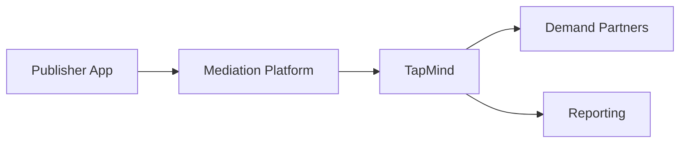

# What is TapMind

TapMind is an ad monetization platform that helps publishers manage ads, demand partners, and revenue from one central place.


**New to TapMind?** This page gives you a complete introduction in under 5 minutes. No technical background required.


---

## What is TapMind?

TapMind is a platform that sits between publisher apps and advertising partners. It helps publishers show the right ads, manage multiple revenue sources, and track performance without rebuilding their app every time something changes.

Think of TapMind as a **control center for ad monetization**. Publishers configure how ads work. TapMind delivers those settings to the app. Demand partners fill ad requests. Reporting shows what happened and how much revenue was earned.


**In one sentence:** TapMind helps publishers earn more from ads while keeping configuration, partner management, and reporting in one place.


TapMind is built for teams that need:

- A single place to manage ad setup across apps and placements
- Flexibility to change ad behavior without waiting for app store releases
- Clear reporting on ad performance and revenue

---

## Why TapMind Exists

Running ads inside a mobile or web app sounds simple. In practice, it creates ongoing operational work.


**The core challenge:** Ad monetization involves many moving parts. Without a central platform, teams spend time on manual updates, inconsistent reporting, and missed revenue opportunities.


TapMind exists to solve these business problems:

**Managing ad monetization across multiple demand sources**

Publishers often work with more than one advertising partner. Each partner has its own rules, formats, and reporting. TapMind brings partner management into one workflow so teams are not juggling separate tools and spreadsheets.

**Avoiding frequent app releases for configuration changes**

Ad settings change often. Priority order, partner assignments, and placement rules may need updates weekly or daily. TapMind lets operations and product teams make those changes centrally. The app picks up new settings without a full release cycle.

**Improving ad revenue**

Revenue depends on showing the right ad to the right user at the right time. TapMind supports structured partner ordering and placement control so publishers can optimize fill rate and earnings over time.

**Centralized reporting and analytics**

Stakeholders need one trusted view of impressions, clicks, and revenue. TapMind collects event data and feeds reporting so product, operations, and client teams work from the same numbers.

---

## How TapMind Works

At a high level, TapMind connects the publisher's app to advertising demand and reporting. No implementation detail is required to understand this flow.

**Step by step:**

1. **Publisher App** — The app requests an ad when a user reaches an ad placement (for example, a banner or interstitial screen).
2. **Mediation Platform** — The layer in the app that decides how ad requests are handled and routed.
3. **TapMind** — The platform that supplies configuration, partner rules, and serving logic based on dashboard settings.
4. **Demand Partners** — External advertising sources that fill ad requests and generate revenue.
5. **Reporting** — Performance and revenue data flows back so teams can monitor results and make decisions.


**Key idea:** The app asks for an ad. TapMind tells it how to serve one. Partners fill the request. Reporting captures the outcome.


This cycle repeats for every ad placement, every session, and every partner in the stack.

---

## Core Platform Capabilities

TapMind supports the full monetization workflow from setup to measurement.

| Capability | What it means for your business |
|------------|--------------------------------|
| **Dynamic configuration** | Change ad behavior from the dashboard without redeploying the app |
| **Demand partner management** | Add, prioritize, and manage advertising partners in one place |
| **Ad serving** | Deliver the right ad configuration to the right placement at runtime |
| **Revenue tracking** | Monitor earnings across partners, apps, and placements |
| **Analytics** | Understand impressions, fill rates, and trends to guide optimization |


**Business value:** Teams spend less time on manual coordination and more time improving revenue and user experience.


---

## Who Uses TapMind

TapMind serves different roles across the organization. Each team gets value from the same platform.

**Publishers**

App owners and publishing businesses that monetize through in-app or in-product advertising. They need reliable ad delivery and clear revenue visibility.

**Operations Teams**

Teams that manage day-to-day configuration, partner setup, and placement rules. They need fast updates and dependable workflows.

**Product Teams**

Teams that define placement strategy, test partner ordering, and measure impact on user experience and revenue. They need flexible control and trustworthy data.

**Developers**

Teams that integrate TapMind into the app and maintain the technical connection. They need stable integration and clear behavior, but business context comes first on this page.


**Support Teams** also use TapMind documentation to answer client questions, troubleshoot issues, and explain platform behavior in plain language.


---

## Related Pages

Continue learning with these pages:

- [Business Problems We Solve](./business-problems-we-solve.md) — Deeper look at the problems TapMind addresses
- [High Level Architecture](../architecture/high-level-architecture.md) — How TapMind's major components fit together
- [End-to-End Ad Journey](../ad-serving/end-to-end-ad-journey.md) — Full flow from ad request to ad display
