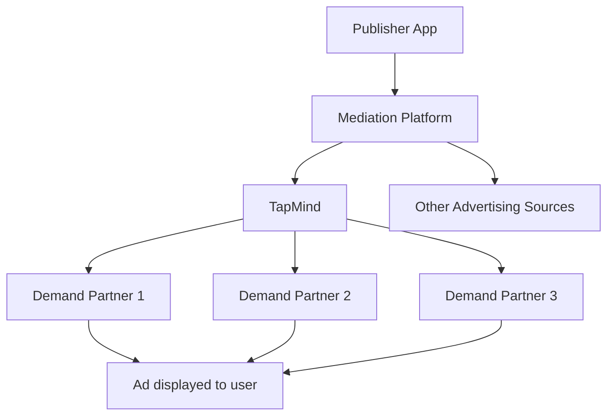

# Where TapMind Fits In

You understand how ads work, who the participants are, and why mediation coordinates multiple advertising sources. This page answers one question:

**Where does TapMind sit within the mobile advertising ecosystem?**

---

## Real World Example

You open **Cricbuzz** and reach a banner placement below the live score.

Cricbuzz uses a **mediation platform** to manage multiple advertising sources. When the app sends an ad request, mediation decides which source gets an opportunity to fill that placement.

Among those sources might be partners specializing in sports brands, consumer goods, or regional campaigns. Mediation coordinates the choice. Cricbuzz earns revenue when an ad is successfully displayed.

TapMind is part of this picture. It does not replace mediation. It participates **within** the setup that mediation manages, alongside other advertising sources.

To understand TapMind's role, we need to ask a simple question.

---

## The Question

Mediation already exists. It coordinates multiple advertising sources. It helps publishers choose which source gets an opportunity for each placement.

So why does TapMind exist at all?

**If mediation already handles coordination, what role does TapMind play?**

This is the right question. TapMind is not a replacement for mediation. It is a platform that helps publishers manage monetization more effectively **through** mediation and beyond a single ad slot decision.

---

## Where TapMind Fits

TapMind sits in the ecosystem as an **advertising demand and monetization platform**.

Here is the simplified picture:

- The **publisher** (Cricbuzz) owns the app and ad placements.
- **Mediation** coordinates which advertising source gets an opportunity when an ad request is sent.
- **TapMind** participates as one of those sources and as a platform that helps publishers manage demand partner relationships, configuration, serving, and reporting.
- **Demand partners** connected through TapMind provide access to advertiser campaigns.

TapMind works **with** mediation, not against it. A publisher's mediation setup might route ad requests to TapMind alongside other sources. TapMind helps manage what happens on the TapMind side: which partners are configured, how placements behave, and how performance is tracked.

Think of it this way: mediation is the coordinator at the front door. TapMind is a specialized partner that also provides tools to manage monetization behind that door.

---

## Why TapMind Exists

Managing multiple advertising sources individually creates operational pain.

Without a centralized platform, publishers face challenges such as:

- **Scattered configuration** across partners, apps, and placements
- **Slow updates** that require app releases for every ad setting change
- **Limited visibility** into performance across demand partners
- **Manual coordination** when partner priorities, formats, or rules change

TapMind exists to reduce that complexity.

From a business perspective, TapMind helps publishers:

- **Simplify operations** by managing demand partners and configuration in one place
- **Optimize monetization** by supporting flexible partner setup and dynamic changes
- **Improve visibility** through reporting and analytics on ad performance and revenue

Publishers still use mediation to coordinate sources. TapMind helps them manage the monetization side more effectively while participating as a demand source within that ecosystem.

---

## What TapMind Provides

TapMind delivers four high-level capabilities. Each supports business outcomes, not technical implementation.

### Demand Partner Management

Publishers work with multiple demand partners. TapMind provides a centralized way to configure, prioritize, and manage those relationships without juggling disconnected tools.

**Business value:** Less manual work, clearer partner control, faster updates.

### Dynamic Configuration

Ad settings change often. Partner priorities, placement rules, and formats may need updates weekly or daily. TapMind lets teams change configuration centrally so the app picks up new settings without a full release cycle.

**Business value:** Faster response to market conditions and fewer deployment delays.

### Ad Serving

When mediation routes an ad request to TapMind, TapMind delivers the configuration and logic the publisher needs to serve the right ad for that placement.

**Business value:** Reliable ad delivery aligned with dashboard settings.

### Reporting and Analytics

Stakeholders need a trusted view of impressions, fill rates, and revenue. TapMind collects performance data and feeds reporting so product, operations, and client teams work from the same numbers.

**Business value:** Better decisions, clearer client communication, and auditable results.

---

## High-Level Diagram

TapMind's position in the ecosystem:

The publisher app sends ad requests through mediation. Mediation may route opportunities to TapMind and to other sources. TapMind connects to multiple demand partners on the publisher's behalf.

---

## Key Takeaways

- **TapMind is not a mediation platform.** Mediation coordinates sources. TapMind participates within that setup.
- **TapMind participates through mediation** as an advertising source and monetization platform.
- **TapMind helps publishers** manage demand partners, configuration, ad serving, and reporting more effectively.
- **Operational simplicity and revenue optimization** are the core business reasons TapMind exists.
- You now have ecosystem context. The next page explains what TapMind is as a platform in more detail.

---

## Next Step

You know where TapMind sits: within mediation, helping publishers manage monetization across demand partners.

The natural next question is: **what is TapMind, and what does the platform deliver day to day?**

Continue to **[What is TapMind](./what-is-tapmind.md)** for a complete platform introduction.
