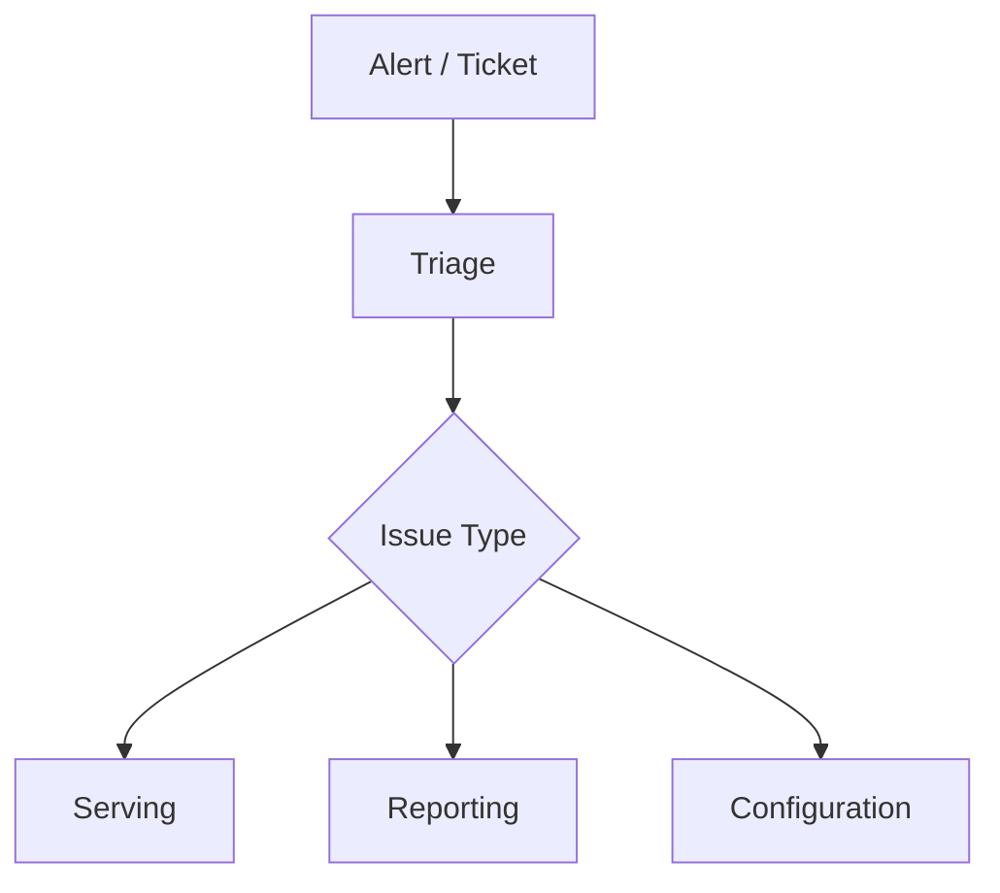

# Monitoring & Troubleshooting

> Placeholder page — content to be expanded.

---

## Overview

<!-- Support team reference for monitoring TapMind and resolving common issues -->

---

## Why It Exists

<!-- Support teams need a single reference for diagnosis and escalation -->

---

## Business Problem

<!-- Downtime, misconfiguration, and reporting gaps impact client trust -->

---

## High Level Explanation

<!-- Plain-language guide to what to monitor and how to triage issues -->

---

## Technical Details

<!-- Logs, metrics, dashboards, and runbooks — after business context -->

---

## Business Benefit

<!-- Faster resolution, reduced escalations, and improved client satisfaction -->

---

## Related Pages

- [End-to-End Ad Journey](../ad-serving/end-to-end-ad-journey.md)
- [Event Lifecycle](../reporting-analytics/event-lifecycle.md)
- [Error Codes](../reference/error-codes.md)
- [FAQ](../reference/faq.md)
