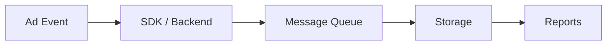

# Event Lifecycle

> Placeholder page — content to be expanded.

---

## Overview

<!-- How events are generated, transmitted, and processed in TapMind -->

---

## Why It Exists

<!-- Events are the foundation of reporting, billing, and optimization -->

---

## Business Problem

<!-- Stakeholders need trustworthy data on impressions, clicks, and revenue -->

---

## High Level Explanation

<!-- Plain-language event journey: trigger → capture → queue → store → report -->

---

## Technical Details

<!-- Event types, schemas, pipeline stages — after business context -->

---

## Business Benefit

<!-- Accurate reporting, auditability, and data-driven decisions -->

---

## Related Pages

- [Reporting Architecture](./reporting-architecture.md)
- [End-to-End Ad Journey](../ad-serving/end-to-end-ad-journey.md)
- [Why RabbitMQ](./why-rabbitmq.md)
