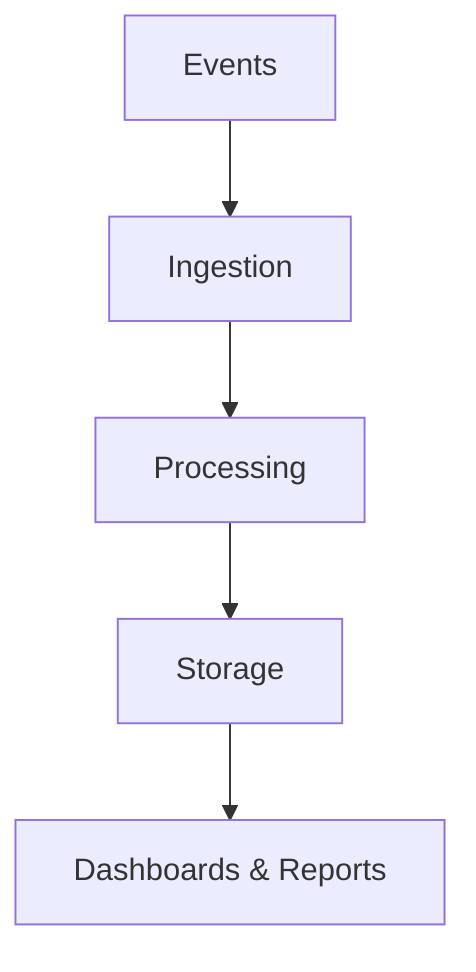

# Reporting Architecture

> Placeholder page — content to be expanded.

---

## Overview

<!-- How TapMind's reporting pipeline is structured end to end -->

---

## Why It Exists

<!-- Reporting is a primary client-facing value of the platform -->

---

## Business Problem

<!-- Fragmented or delayed data undermines trust and decision-making -->

---

## High Level Explanation

<!-- Plain-language overview of ingestion, processing, storage, and delivery -->

---

## Technical Details

<!-- Services, data stores, and integration points — after business context -->

---

## Business Benefit

<!-- Timely, accurate insights for clients, PMs, and operations -->

---

## Related Pages

- [Event Lifecycle](./event-lifecycle.md)
- [Why RabbitMQ](./why-rabbitmq.md)
- [Why MongoDB](./why-mongodb.md)
- [Why PostgreSQL](./why-postgresql.md)
