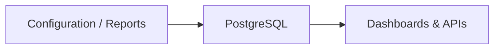

# Why PostgreSQL

> Placeholder page — content to be expanded.

---

## Overview

<!-- What PostgreSQL is and its role in TapMind — plain English first -->

---

## Why It Exists

<!-- Why TapMind uses relational storage for structured configuration and reporting -->

---

## Business Problem

<!-- Reliable, queryable storage for configuration hierarchy and aggregated reports -->

---

## High Level Explanation

<!-- Plain-language analogy: PostgreSQL as a structured ledger for trusted business data -->

---

## Technical Details

<!-- Tables, relationships, and TapMind-specific usage — after business context -->

---

## Business Benefit

<!-- Data integrity, complex queries, and trusted reporting for clients -->

---

## Related Pages

- [Reporting Architecture](./reporting-architecture.md)
- [Dashboard Hierarchy](../configuration-management/dashboard-hierarchy.md)
- [Why MongoDB](./why-mongodb.md)
