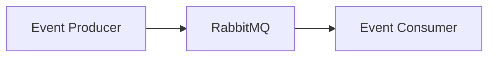

# Why RabbitMQ

> Placeholder page — content to be expanded.

---

## Overview

<!-- What RabbitMQ is and its role in TapMind — plain English first -->

---

## Why It Exists

<!-- Why TapMind uses a message queue in the reporting pipeline -->

---

## Business Problem

<!-- Reliable, asynchronous event processing at scale -->

---

## High Level Explanation

<!-- Plain-language analogy: RabbitMQ as a post office for ad events -->

---

## Technical Details

<!-- Queues, exchanges, routing, and TapMind-specific usage — after business context -->

---

## Business Benefit

<!-- Decoupled processing, resilience, and scalable event handling -->

---

## Related Pages

- [Reporting Architecture](./reporting-architecture.md)
- [Event Lifecycle](./event-lifecycle.md)
- [Why MongoDB](./why-mongodb.md)
